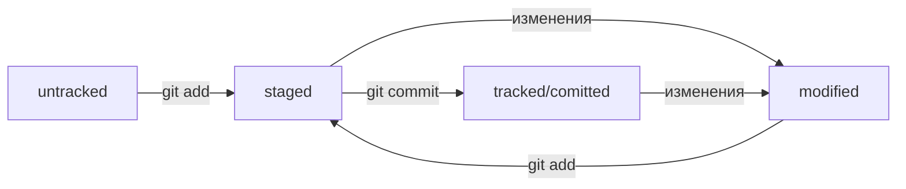

Привет! 👋
Меня зовут Илья, я начинающий разработчик. Занимаюсь программированием на Python.
Примеры моих работ:

Мой основной стек: Python | Django | DRF | React | Git | SQL | Linux


# Мой первый README файл

## А также первое использование маркдауна

Это _курсив_, а это **жирный** текст

* Первый пункт
* Второй пункт

[Google](https://google.com "Загугли блин")

```python
def is_valid(a, b):
    return a > 2 and b < 5 
```

## Mermaid схема


